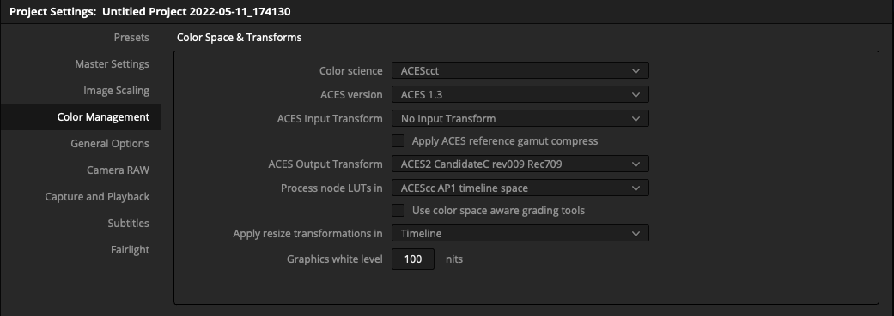
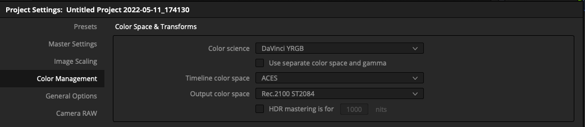
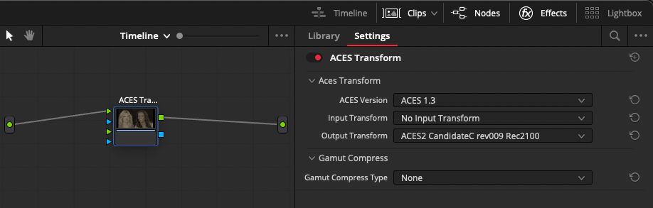

# ACES ODT Candidates
 Prebaked LUTs of the ACES 2.0 ODT candidates from the [ACES Output Transforms Architecture Virtual Working Group](https://paper.dropbox.com/doc/Output-Transforms-Architecture-Virtual-Working-Group-HKNpj824NA0Z8tn7jiPS0)

This repo contains:
* a Nukescipt used to bake the LUTs.
* A dctl template to wrap them in a way Resolve will treat as a valid ACES ODT.
* A FilmLight Display Rendering Transforms intended for use in Baselight.

Comparison frames can be viewed here. (Only works under some specific setups.)

[ACES_ODT_Candidates_Examples](https://alexfry.github.io/ACES_ODT_Candidates_Examples/)

# Installation

## OCIO for Nuke and other Applications

There is a cutdown OCIO config based on the current ACES 1.2 config.
It includes all Input and Utility spaces, but a greatly reduced set of Output spaces.

There are two config variations:
* A standard `config.ocio` for general use in Nuke on Linux and Windows, and other generic OCIO applications.

* And a second `condig_DisplayP3.ocio` intended for use with Nuke 13 on a Mac with EDR support.
This can be enabled via the `Preferences -> Color Management -> Enable macOS HDR Color Profile` checkbox, and setting the `gl buffer depth` to `half-float` in the Viewer settings pane.

## Filmlight Baselight

### 1. Adding the DRTs to Baselight:
- Copy all the files contained in `ACES2_0_Candidates_rev009` to the colourspace folder 
    - Linux & Mac: `/vol/.support/etc/colourspaces`

- Restart Baselight
- You should see three new custom DRTs in `Scene Settings -> Format & Colour -> Display Rendering Transform`

Note : Candidate C currently will not display correctly in baselight because of a shaper gamut change.

## Davinci Resolve

### 1. Adding a Custom ACES IDT or ODT File:
- Navigate to the `ACES Transforms` folder in Resolve's application support folder.
    - MacOS: `~/Library/Application Support/Blackmagic Design/DaVinci Resolve/ACES Transforms`
    - Windows: `C:\Users\<User>\AppData\Roaming\Blackmagic Design\DaVinci Resolve\Support\ACES Transforms\IDT`
    - Linux: `~/.local/share/DaVinciResolve/ACES Transforms`
- Place your custom ACES DCTL files for Input Device Transforms (IDTs) in the IDT subfolder.
- Place your custom ACES DCTL files for Output Device Transforms (ODTs) in the ODT subfolder.
- Start Resolve.

There are two pathways for testing the candidate transform in Resolve.

### A: Standard ACES project

Using a standard ACES mode project the OT candidates can be found under the `ACES Output Transforms` submenu.

The only caveat here is that Resolve currently doesn not support output space tagging for custom DCTL transforms, so whilst they will work as expected with external monitors, they will no be picked up correctly if you use "Use Mac display color profiles for viewers" option, which in turn means EDR/HDR display will not work correctly.

### B: Stock DaVinci YRGB project with manual ACES node

You can also set you project to use the stock `DaVinci YRGB` colour science mode.

And then drop an ACES Transform node at the timeline level.

The advantage of this method is that EDR display on the Mac will work properly, as will the ouput scopes.